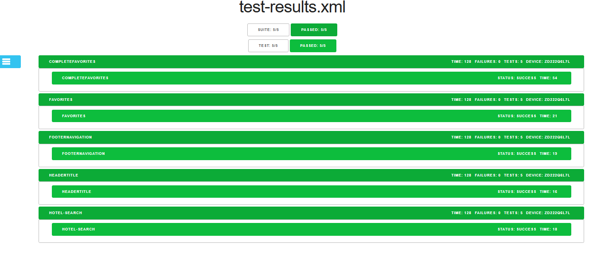

# HotelSearch-Automation

This project contains Maestro automation flows for the Hotel Booking mobile app.

## Structure
- `flows/` : Contains YAML files defining test flows
- `tests/` : Contains test files and JUnit results
- `artifacts/Reports/` : Contains generated reports (JUnit XML, HTML)
- `artifacts/screenshots/` : Contains screenshots taken during tests

### Install Java (JDK 11 or newer)
      https://adoptopenjdk.net/

### verify Java
    java -version
### Install Android SDK (for Android automation)
    Download and install Android Studio → this will install the SDK + Emulator
    https://developer.android.com/studio

     Once installed:

    Open Android Studio once → set up emulator/device

### Add SDK tools to PATH:
     export PATH=$ANDROID_HOME/emulator:$ANDROID_HOME/platform-tools:$PATH

### macOS - Install Xcode (for iOS automation)
    Download Xcode from App Store:
    https://apps.apple.com/us/app/xcode/id497799835

      Open Xcode once and accept the license:

      sudo xcodebuild -license accept

###  Install Maestro

#### macOS / Linux
     curl -Ls "https://get.maestro.mobile.dev" | bash
#### Windows (PowerShell)
     iwr https://get.maestro.mobile.dev -useb | iex
####   Verify Maestro installation
    maestro --version
### Set up emulator / device
#### Use Android Studio AVD Manager → create and start an emulator OR connect a real device (USB debugging enabled)

### T o install Junit viewer for reporting
 `npm install -g junit-viewer`


### To execute a particular test
`maestro test search.yaml --format junit --output ../artifacts/Reports/test-results.xml`

### To execute all tests in the folder (from root folder)
`maestro test tests/ --format junit --output artifacts/Reports/test-results.xml`

### To convert XML report into HTML report
`junit-viewer --results=../artifacts/Reports/test-results.xml --save=../artifacts/Reports/report.html`

### To convert XML report into HTML format (from root folder for all test cases execution)
`junit-viewer --results=artifacts/Reports/test-results.xml --save=artifacts/Reports/report.html` 

### Run the below command if running scripts are disabled on the system
`Set-ExecutionPolicy -Scope Process -ExecutionPolicy Bypass`


## Project Folder Structure

## Project Folder Structure

```plaintext
HotelSearch-Automation/
├── artifacts/
│   ├── Reports/
│   │   ├── report.html
│   │   └── test-results.xml
│   └── screenshots/
│       ├── AccountTab.png
│       ├── BackToHotelTab.png
│       ├── Delhi-search.png
│       ├── Delhi-zaza-favorite.png
│       ├── FavoritesHotels.png
│       ├── FavoritesTab.png
│       ├── NewYork.png
│       └── OverviewTab.png
├── flows/
│   ├── applaunch.yaml
│   └── Fav.yaml
├── inputs/
├── tests/
│   ├── Completefavorites.yaml
│   ├── favorites.yaml
│   ├── footernavigation.yaml
│   ├── Headertitle.yaml
│   └── hotel-search.yaml
├── image.png
└── README.md
```
## Screenshots

